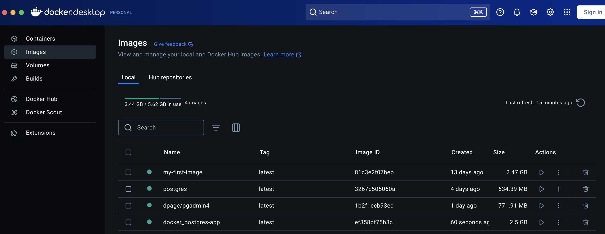
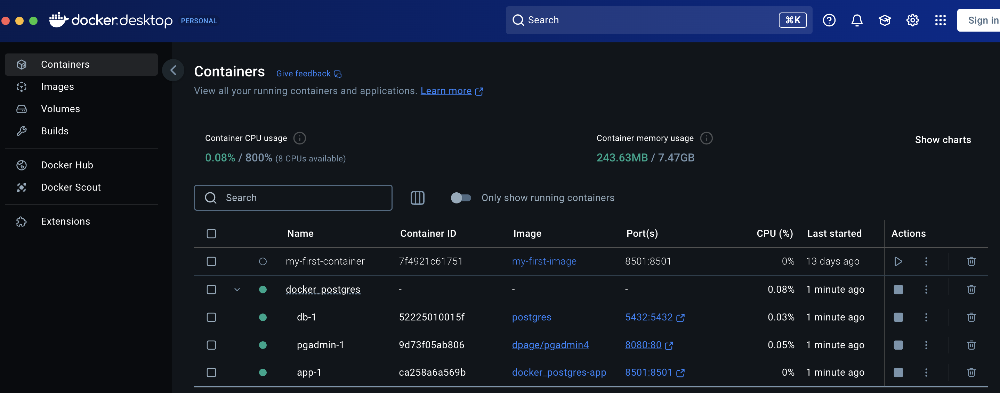
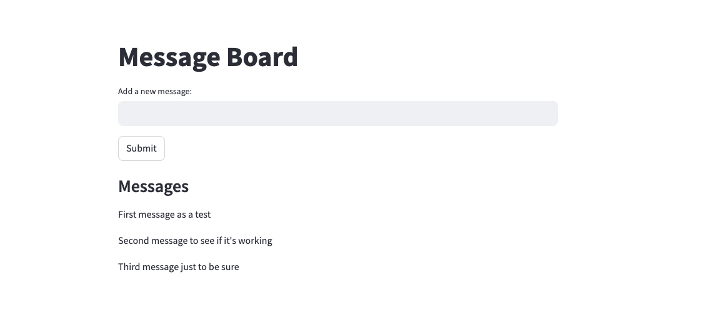
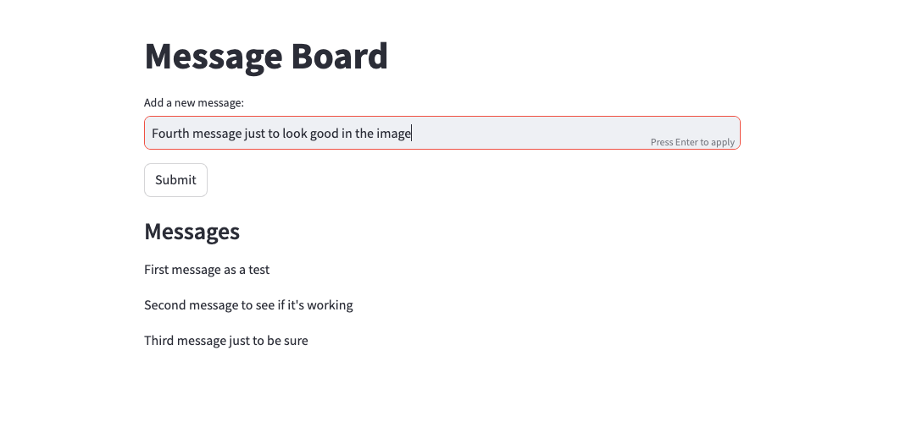
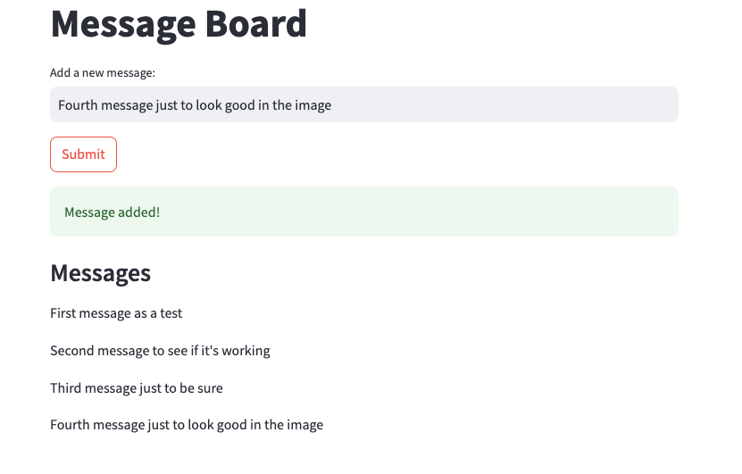

# Moving Forward with Docker
This is another simple project that I did to start getting used to Docker.

## Project Rundown
After starting the project using Poetry and configuring the hooks of the ```pre-commit``` package, I created a very basic Streamlit application so that I could create multiple Docker Images and Containers using a ```docker-compose``` file.

Using the command ```docker compose up``` you can build multiple Images and Containers based on the instructions written down in the ```docker-compose``` file and ```Dockerfile```, which will appear on the Docker desktop application:





In this case, clicking in the IP on the _Port_ section of the ```app-1``` Container will open the Streamlit application.

Basically the application connects to a Postgres Database, creates a table, add values in the table based on the text that the user writes and return all the values from the table:







## Conclusion and Reference
Using the ```docker-compose``` file helps a lot when you need to create multiple Images and Containers to run an application. Also, using the Postgres and PgAdmin Images available on the Docker Hub allows you to have access to a Postgres database without needing to download and install these tools.

This project was suggested also in the Docker Workshop available on [Jornada de Dados](https://suajornadadedados.com.br/).
